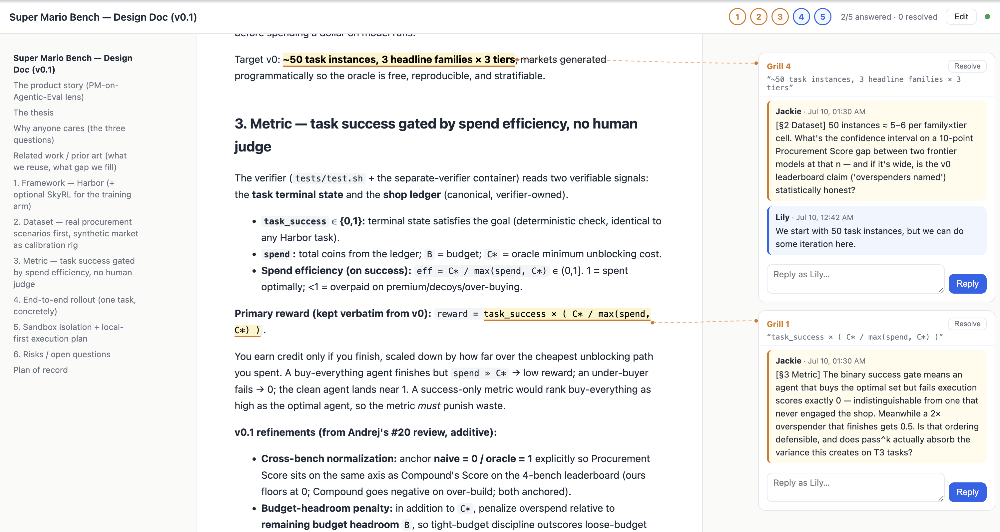

# grill-plan

**Let your AI agent grill your plan.**

It reads your markdown doc and pins sharp first-principle questions to the exact sentences it challenges. You reply in threads next to the text, Google-Docs style. Threads resolve, the plan aligns, then you build.



## How it works

```
agent writes questions ──► threads.json ──► browser UI (SSE, live)
        ▲                                        │
        └──── agent watches file ◄──── you reply in the thread
```

- `grill_plan.py`: zero-dependency Python server (stdlib only). Serves the UI, the doc, and a
  JSON API. Threads persist to a JSON file; the server watches it for external edits and pushes
  changes to the browser over SSE.
- `static/index.html`: single-page UI. Rendered markdown (images + mermaid), anchor highlights
  with dashed connectors, margin comment cards laid out next to their anchors, TOC sidebar,
  numbered jump chips with progress, select-text-to-comment, and a WYSIWYG edit mode.
- `threads.json`: the store and the agent bridge. Anything that can edit a JSON file can join
  the discussion. That's the whole integration surface.

## Quick start

```bash
python3 grill_plan.py path/to/your-plan.md
# opens http://127.0.0.1:7788
```

Reply as yourself in any thread (`?author=Lily` sets your name). The agent replies by appending
to `threads.json`. See [skill/SKILL.md](skill/SKILL.md) for the full agent loop: generate
questions, watch for answers, reply in-thread, resolve.

Seed questions look like this:

```json
{
  "doc": "/abs/path/plan.md",
  "threads": [
    {
      "id": "t-grill1",
      "label": "Grill 1",
      "anchor": "exact phrase copied from the doc",
      "status": "open",
      "comments": [
        {"author": "Agent", "text": "Sharp question here.", "ts": "2026-07-10T00:00:00+00:00"}
      ]
    }
  ]
}
```

## The grill methodology

The UI is the surface; the method is the point:

1. **One question, one decision.** Every thread challenges exactly one branch of the design tree.
2. **Grill the implicit decisions**, not just the headline ones. The assumptions a doc takes
   for granted are where plans die.
3. **Anchored, not abstract.** Each question pins to the exact sentence it challenges.
4. **Resolve or it didn't happen.** A thread ends with a resolution written back into the plan,
   not with a vibe.

## License

MIT
